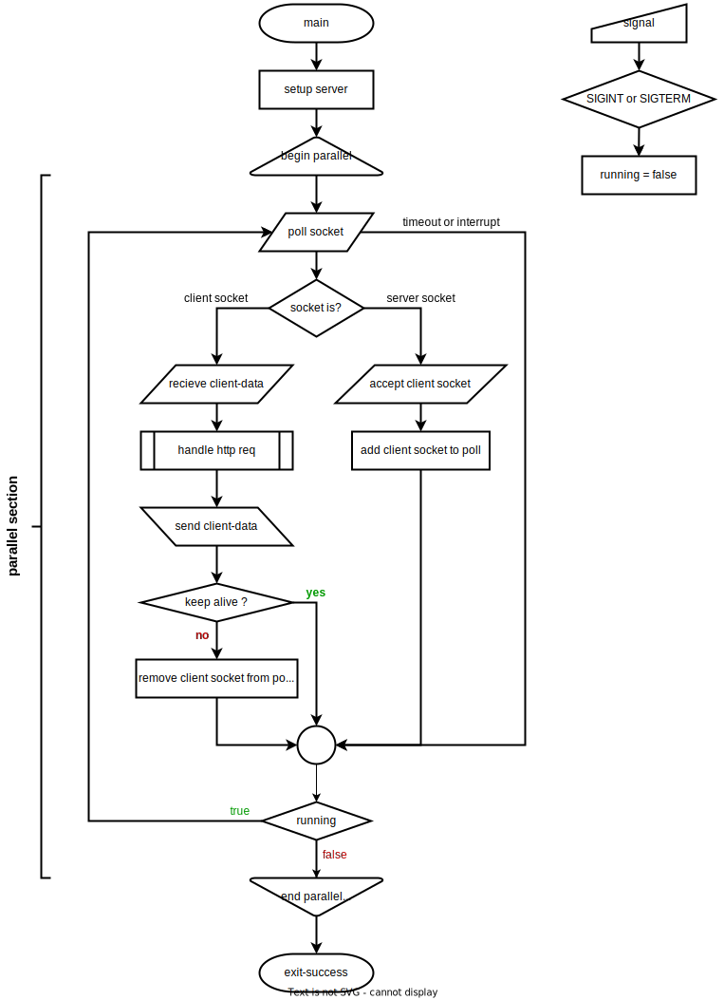

# HTSuSExP
Hyper Text Server using Simple Executable Pages
using the epoll linux sys-call,
the openssl library
and OpenMP for MT.

ExP's (Executable Pages) are small shared objects,
loaded into cache on first request,
that are defined by exp.h

## Server

### Flowchart

### Comments
